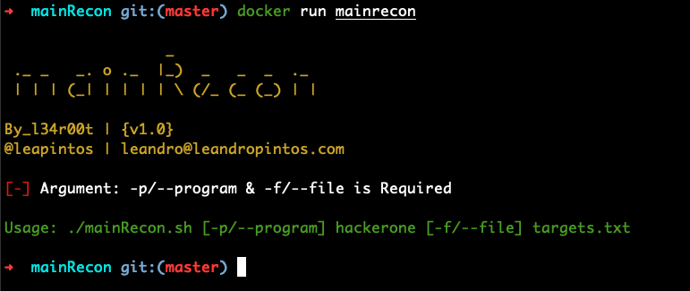
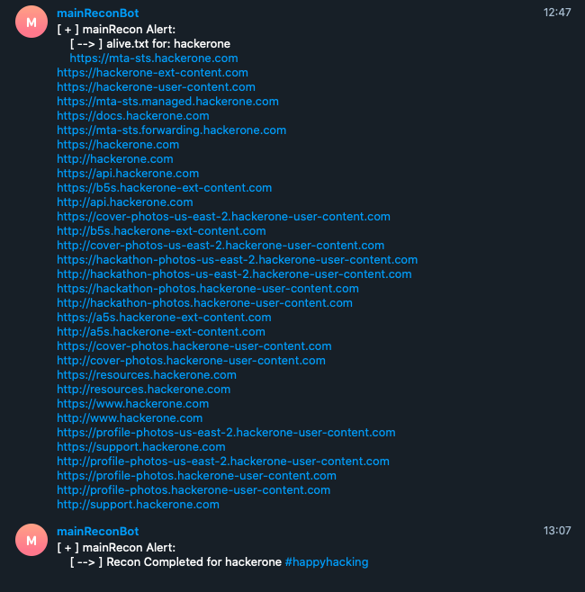

 

  

  <h3 align="center">mainRecon Results</h3>

  
  
  
  
  
  
  
  
  
  

  mainRecon for bugbounty hunter is an image with a bash script with some of the tools used at recon workflow.

## mainRecon results

### h1-Recon

### mainRecon Alert

### mainRecon Results

In the following repository you will obtain all hackerone recon results.

1. [h1 recon results](./hackerone-2020-09-01/)